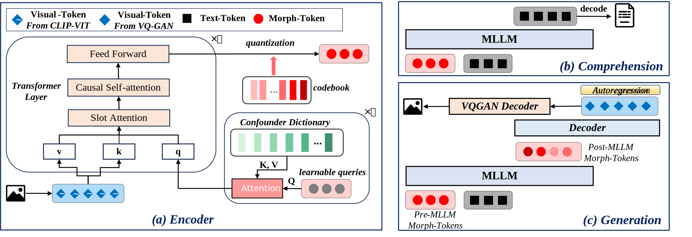
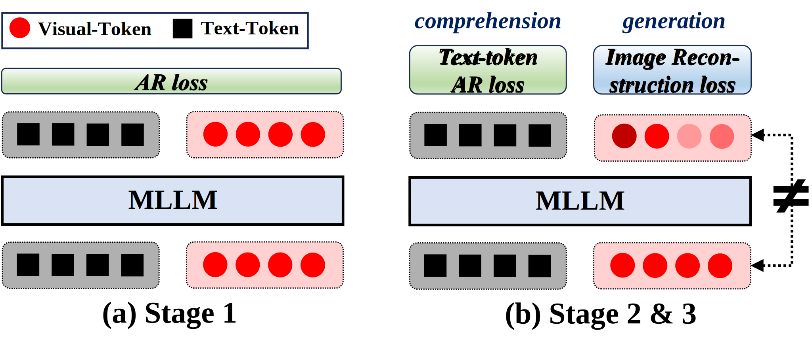

<h1 align = "center">
Auto-Encoding Morph-Tokens for Multimodal LLM
</h1>

<div align="center">
Kaihang Pan<sup>1</sup>, Siliang Tang<sup>1</sup>, Juncheng Li<sup>1,2&dagger;</sup>, Zhaoyu Fan<sup>1</sup>, Wei Chow<sup>1</sup>, Shuicheng Yan<sup>3</sup>, Tat-Seng Chua<sup>2</sup>, Yueting Zhuang<sup>1</sup>, Hanwang Zhang<sup>3,4</sup>


<sup>1</sup>Zhejiang University, <sup>2</sup>National University of Singapore, <sup>3</sup>Skywork AI, <sup>4</sup>Nanyang Technological University

<sup>&dagger;</sup>Corresponding Authors


</div>

## Overview

We introduce **Morph-Tokens** to resolve the conflicting objectives of visual comprehension. The term ''morph'' implies a transformation where the pre-MLLM visual-tokens are ***not necessarily equal*** to the post-MLLM ones. Specifically, the pre-MLLM tokens are abstract semantics, serving as visual prompts for comprehension tasks. In contrast, the post-MLLM tokens are visually complete tokens for image generation, thanks to the powerful comprehension ability of MLLM that recovers the lost visual features due to abstraction. The framework of our morph-token-based MLLM is shown in the following figure:
<div>

</div>
On this basis, we propose a 3-stage training strategy as shown in the following figure. After training, it shows remarkable abilities, exceling at both multimodal comprehension and generation.
<div>

</div>

## Acknowledgment

Thanks to the open source of the following projects:
* [LAVIS](https://github.com/NExT-GPT/NExT-GPT): A Library for Language-Vision Intelligence.
* [MiniGPT-4](https://github.com/Vision-CAIR/MiniGPT-4): Enhancing Vision-language Understanding with Advanced Large Language Models.
* [taming-transformers](https://github.com/CompVis/taming-transformers): Taming Transformers for High-Resolution Image Synthesis.
* [SEED](https://github.com/AILab-CVC/SEED): Making LLaMA SEE and Draw with SEED Tokenizer.

## Citation

If you found this work useful, please consider citing our paper as follows:
```bibtex

```